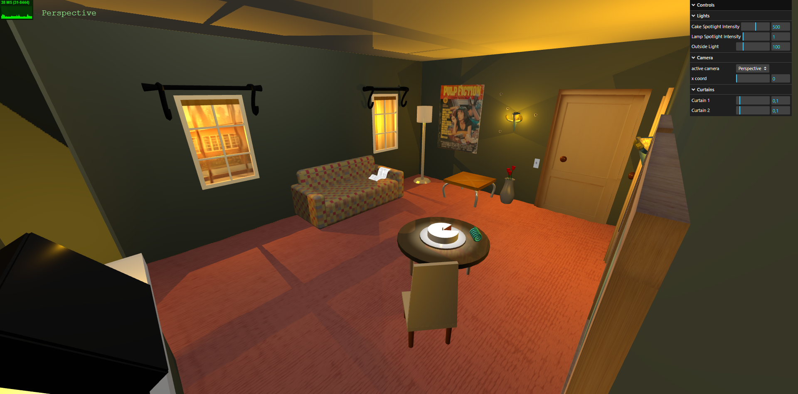
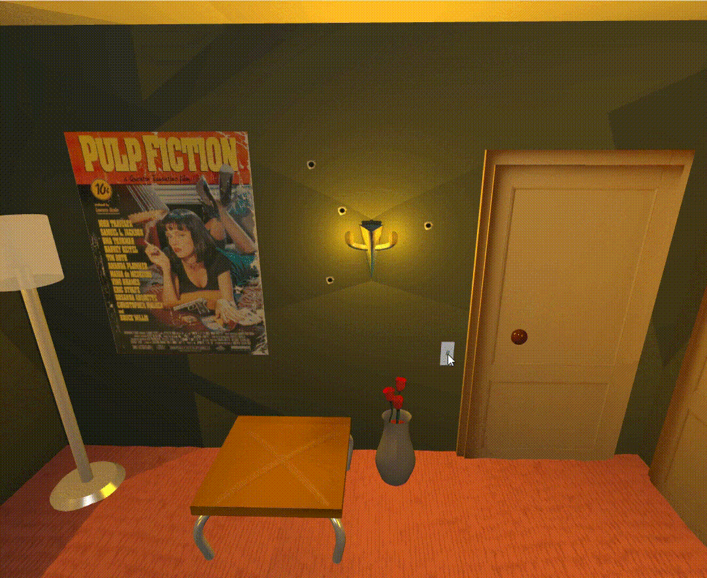
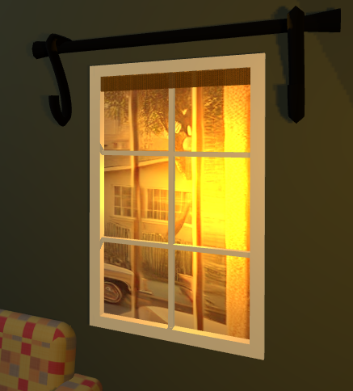
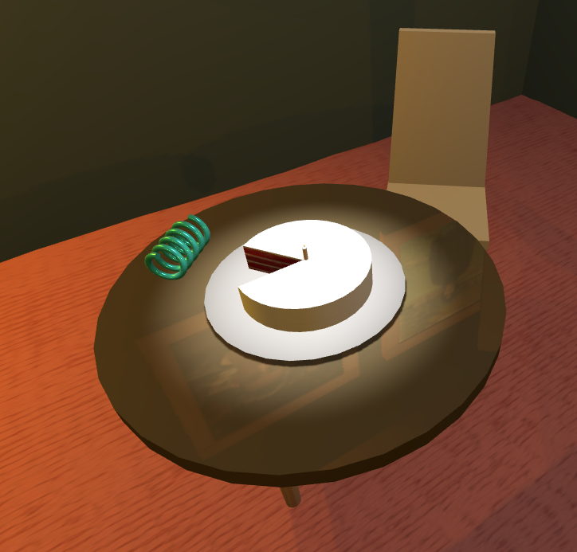
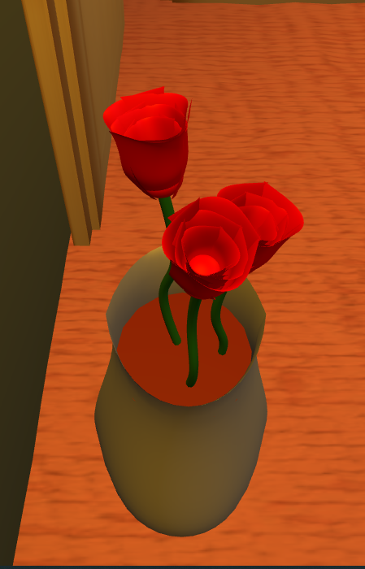
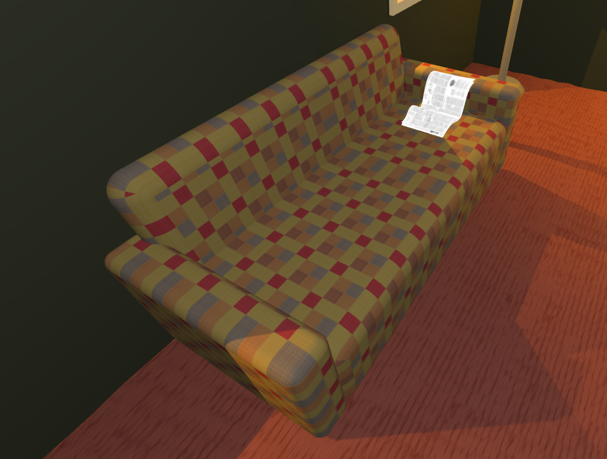
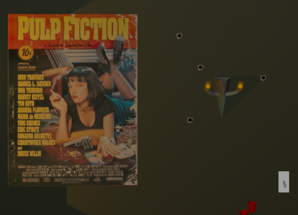

# SGI 2024/2025 - TP1

## Group: T0xG0y

| Name             | Number    | E-Mail             |
| ---------------- | --------- | ------------------ |
| Diogo Tomás Valente Fernandes         | 202108752 | up202108752@fe.up.pt                |
| Jaime Francisco Rodrigues Fonseca         | 202108789 | up202108789@fe.up.pt                |

----
## Project information

Our project is inspired by the iconic apartment scene from the popular movie Pulp Fiction. To recreate this environment as realistically as possible, we developed a scene using THREE.js, employing geometry, curves, materials, and lighting to make it as immersive as we could.

  
  
Figure 1: Project overview

## Topics

- [Code Organization](#code-organization)
- [Controls](#controls)
  - [Lights](#lights-controls)
  - [Cameras](#cameras-controls)
  - [Objects](#objects-controls)
- [Objects - Strong  Points](#objects-strong-points)  
  - [Structure](#structure)
  - [Windows](#windows)
  - [Table](#table)
  - [Flower](#flower)
  - [Extra Objects](#extra-objects)

### Code Organization

All the objects present in the scene are initialized and drawn in the MyContents.js. We have five different folders containing all the necessary files to build our scene:
  - Helpers: Contains all the  helper functions used throughout the project. **MyNurbsBuilder.js** was used to create the curved superficies used in the flower, for instance. **deCasteljau.js** overrides the *getPoint* method of the *THREE.Curve* class, done with the purposeof giving us more control, used to build the wall lamps, for example.
  - Images: Contains all the images used for this report
  - Texture: Contains the textures used in the scene
  - Sounds: Contains the sounds used in the scene (the sound of clicking the switch to turn the wall lights on)
  - Objects: Contains all the objects in the scene. It is subdivided into structure folder, which contains the objects used to provide a structure for the scene, the walls, the ceiling etc. The other folders are self-explanatory. Important to note that for some objects composed of different parts, we used *THREE.Group()* function to change the entire object as an whole.

### Controls

The scene provides to the user the ability to control a different of set  of parameters, such as the lights, cameras and some of the objects in the scene.

#### Lights Controls

In our scene, through the use of the GUI.Interface in the right top corner , the user can control the scene 's lights. 
  - The user can control the **intensity of the spotlight pointed at the cake** in the center of the table. 
  - The light **intensity of the candle next to the movie official poster**. 
  - The **outside light intensity** which has a direct impact on the overall brightness of the scene. Important to notice that the outside light is a directional light. It is possible to see in the scene the shadows from the windows frame, from the other objects etc.
  - The user can also turn on/off the **wall lights**. However this is not done using the guiInterface but rather by clicking the button itself. It even makes a sound :)

  
  
Figure 2: Wall Lights

#### Cameras Controls

There is a number of different controllable  cameras in the scene. The user can control the camera position and rotation. The camera can also be moved along the x coord. Besides the four ortographic cameras giving a view from the left/right/top/bottom, there are three extra cameras:
- Perspective  camera: This camera is used to create the perspective view of the scene. We can see the entire scene and the view from the windows.
- JohnTravolta camera: This camera provided a view from where the actor's character was standing in the movie, just in fron the suitcase.
- Samuel LJackson camera: The same logic as before, but in this camera we can see the table are, the sofa, and the suitcase a bit more distant.

#### Objects Controls

Finally , we can also control some objects of our scene.
- The user can control the table and move it as he wants along the xyz axis.
- The user can also control, both the curtains present in the scene. This one is a bit more interesting, because it affects the overall brightness of the scene, as it controls the amount of light coming from the outside.

### Objects Strong Points

As required, we are not going in-depth about how every single object in the scene was made, especially because some of them, the code is straightforward, and there is not much to add. Instead, we are going to highlight some of the strong points in some of the objects, as we think it values our project as a whole.

#### Structure

The structure of the scene, composed with the ceiling, the floor and the walls are all mandatory parts of the project. However it is important to notice that their constructed is done dynamically. This is,  the user can change the size of the room, and the structure will adapt to the new size., rather than being hard-coded.

#### Windows

The construction of windows is automatic. This is because we only have to say where to position the window, and everything else is done automatically. It makes an hole in the wall, build the frame, the light source from the outside and even the view from the outside is positioned solely in the walls that have windows. The view from outside is not just a texture in the window but a real 3D view from the outside, which we can see from the holes created for the window. This was done to provide a more realistic view.

  
  
Figure 3: Window

#### Table

The table was also one of the mandatory objects in the project. However it is important to notice that the table legs are not placed hard-coded but rather relative to the dimensions of the table, and the top of table if reflective, made possible through the use of a *MeshPhongMaterial* and a *WebGLCubeRenderTarget*.

The back rest of a chair is a trapezoid. To create that effect, we used a *CylinderGeometry* with such attributes that create this effect, and then we scaled it. Credits to [this stack overflow post to create the trapezoid](https://stackoverflow.com/questions/49481332/how-to-create-3d-trapezoid-in-three-js).

  
  
Figure 4: Table

#### Flower
The flower is a very interesting part of our project as we wanted to do something different from what we have done in the previous Computer Graphics Course. For the stem, we used a *TubeGeometry* with a *BezierCurve* associated. For the flower itself, the petals are made with a curved surface. We group 3 petals together to form a ring of petals. Then we replicate the ring three times, with a slight rotation between each ring to provide the effect of how a real world flower looks like (randomness). We also added a sphere at the base of the flower to provide a more realistic look.

  
  
Figure 5: Flowers

#### Extra Objects

To enhance our scene, some non-mandatory objects were addded. Some of them didn't require to use any special geometry while others were more challenging.
- Lamp : Built using *CylinderGeometry*
- LightSwitch:  Built with BoxGeometry and interactive; clicking it toggles wall lights with a sound effect.
- Counter: Built using *BoxGeometry*
- LittleTable: *BoxGeometry* and *TubeGeometry* with *BezierCurves* associated
- Sofa: More challenging to build, because to create the shape of a sofa, which normally has rounded edges, we used *THREE.Shape()* with an *ExtrudeGeometry()*

  
  
Figure 6: Sofa

- Suitcase: Built using *BoxGeometry*
- BulletHoles in the wall: To create the bullet holes, we combined a *CircularGeometry* with a texture, the challenging part was to set the background area of the texture to be transparent. We had to edit the texture, to set the background to be transparent, but THREE.js by default put it as a solid color (black). We needed to change that, to read it as transparent.

  
  
Figure 7: Bullet Holes

## Issues/Problems

- We had difficulty correctly applying textures to the sofa due to its complex shape.