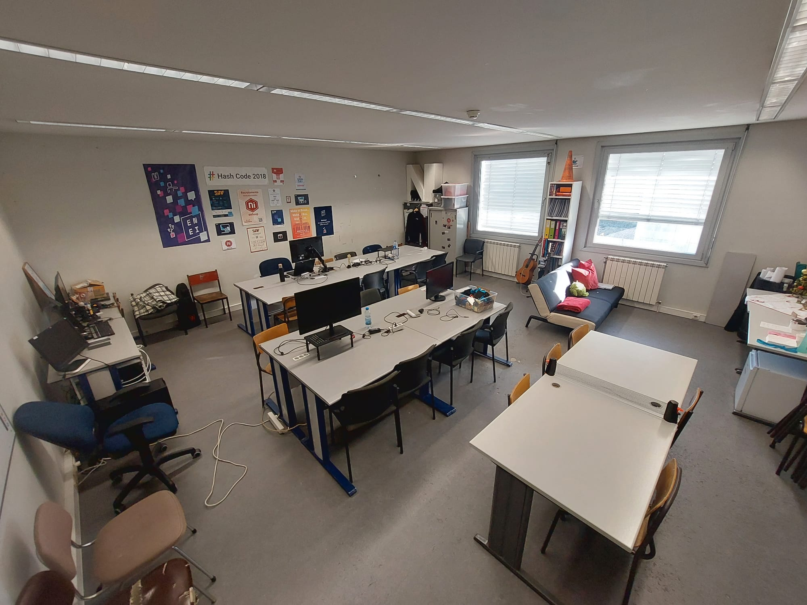
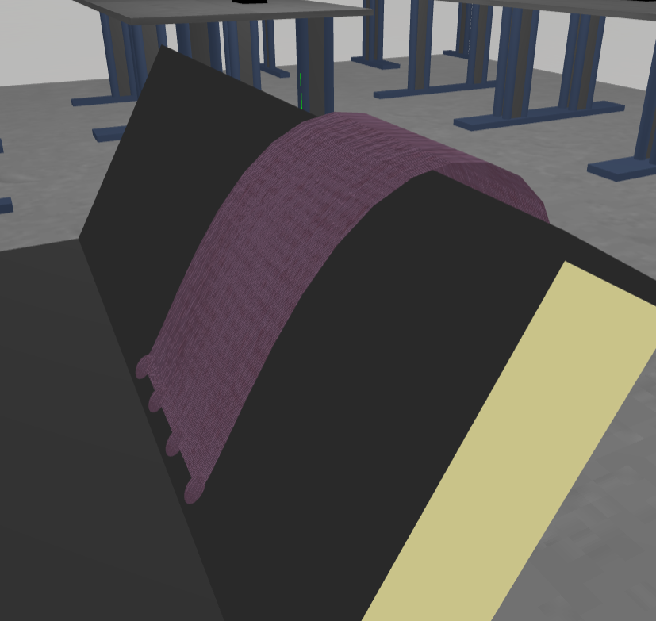
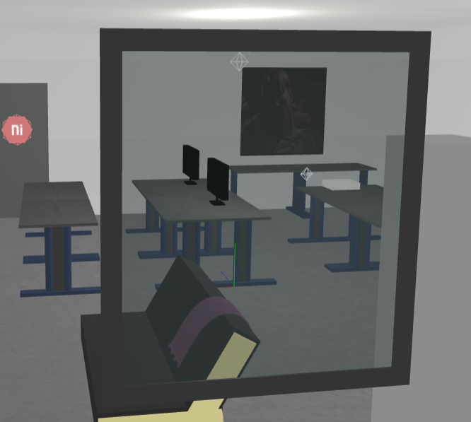

# SGI 2024/2025 - TP2

## Group: T0xG0y

| Name             | Number    | E-Mail             |
| ---------------- | --------- | ------------------ |
| Diogo Tomás Valente Fernandes         | 202108752 | up202108752@fe.up.pt                |
| Jaime Francisco Rodrigues Fonseca         | 202108789 | up202108789@fe.up.pt                |

## Project information

Our project is inspired by the NIAEFEUP (Núcleo de Informática da Associação de Estudantes da Faculdade de Engenharia da Universidade do Porto) room. To develop this project as realistically as possible we developed a scene using THREE.js and different objects and materials. The scene is on a scale with reality.

Reality:

  
  
Figure 1: Project inspiration

Our scene:

  
  
Figure 2: Scene developed

  
  
Figure 3: Scene developed - different angle

## Topics

- [Code Organization](#code-organization)
- [Controls](#controls)
- [Objects](#objects)  
  - [Blanket](#blanket)  
  - [NIAFEUP Logo](#logo)  
  - [Windows](#windows)  
- [Textures](#textures)

### Code Organization

The code is mainly organized through three different folders.

  - Loaders - Responsible for loading each component of our scene
    - LoadCameras
    - LoadGlobals
    - LoadMaterials - Returns the material loaded and two variables texlength_s and texlength_t. As we do not know over each object the material (which might have a texture) is going to be applied we pass these variables and then make the adjustments in loadObjects
    - LoadObjects
    - LoadTextures
  - Objects - Classes we had to define to create certain special objects
  - Parser - Contains the parser itself that is going to call the respective Loaders

### Controls

Our scene is controllable following the guidelines in the project's description. Therefore, we have the following controls:

  - Lights: It is possible to control the intensity of the lights defined in the yasf file.
  - Cameras: It is possible to switch between the different cameras defined.
  - Wireframe: It is possible to set the materials of all the objects in the scene with the wireframe flag set to true. There is one object (in our scene is the outer frame of the NIAFEUP symbol on the door) that has this always set to true, unable to change it as defined in the project proposal.   

### Objects

This project was less focused on developing more complexed objects compared to the previous one as we also add to develop all the parser logic. However some more complexed objects still had to be defined, including objects using *Buffer Geometry*, the *triangle* and the *polygon*. 

Developing the triangle was straight-forward, but it is important to notice that upon defining the *uvs* for the triangle we do not divide by the respective value of texlength as *repeat()* is used upon adjusting the textures as it will be explained further. The most complex objects created in our scene in specific were:

#### Blanket

The blanket placed on the sofa was made using nurbs and applied a bump texture to create the effect of a real-life blanket

  
  
Figure 4: Blanket

#### Logo

The logo is not just an image. Two polygons (hexagons) were built, one as a wireframe. The inside part is a rectangle with a texture with the letters.

  
  
Figure 5: NIAFEUP Logo

#### Windows

The windows are made of a semi-transparent material with a subtle blueish color applied to give the most realistic effect possible.

  
  
Figure 6: Windows

Also important to notice, some other aspects of our scene that were made in order to best optimize the overall performance of the scene, as well as to apply the knowledge gained in this curricular unit:

  - For the monitor's screens mipmaps were applied as we knew we would have several monitors, we wanted to be sure this technique was being used correctly

  - For the books on the shelves, LODs were used for the same reason. Since we expected to have several books, we used LODs to optimize performance.

  - Video Texture to simulate the projector's display

### Texture 

Textures had to be adjusted depending on the object they are going to be applied to. Some of the objects such as the rectangle, sphere etc leave no space for interpretation but some do, and the procedure chosen is going to be explained:

- Cylinder : The math was done using the base of the cylinder (same with the cone for example)

- Curved Superficies : Three iterations of DeCasteljau algorithm are run, to provide a good approximation without being too computationally heavy. Then the different segments are added. For the width we take the average width of the curve. 

### Notes

- The fetch operation when reading the file is asynchronous. Early on in the project, we realized that the scene could be attempted to load before all the scene properties were properly defined. To address this issue, we modified the logic in the *FileReader* to return a JavaScript *Promise*. In *MyContents* (and consequently in *main*), we used *await* to ensure the file was fully read before proceeding.